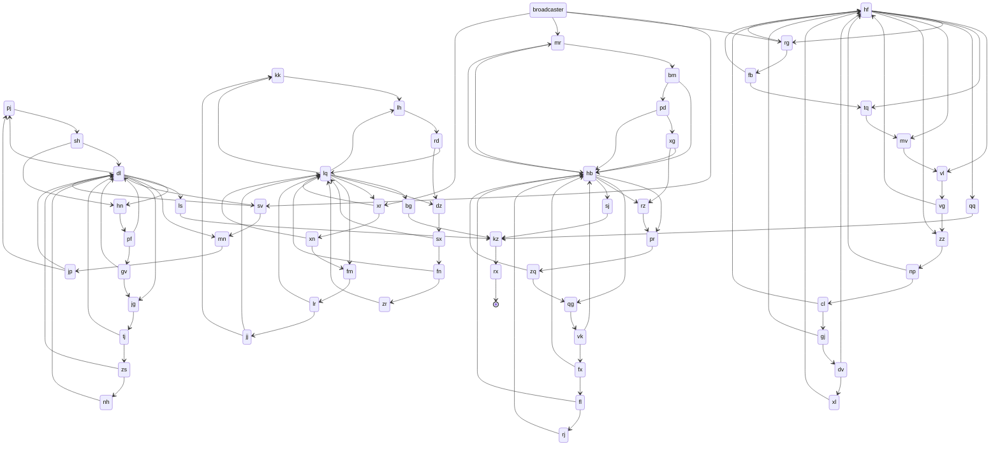

# Day 20

```mermaid
stateDiagram-v2
    pj --> sh
    mn --> jp
    hf --> rg
    hf --> vl
    hf --> tq
    hf --> qq
    hf --> mv
    hf --> zz
    xl --> hf
    sv --> mn
    sv --> dl
    kk --> lh
    sj --> kz
    jj --> lq
    jj --> kk
    mr --> bm
    mr --> hb
    sx --> lq
    sx --> fn
    fn --> zr
    fn --> lq
    pf --> dl
    pf --> gv
    lr --> lq
    lr --> jj
    jp --> pj
    jp --> dl
    hb --> pr
    hb --> qg
    hb --> rz
    hb --> mr
    hb --> sj
    vg --> hf
    vg --> zz
    pr --> zq
    hn --> pf
    jg --> tj
    qg --> vk
    dv --> hf
    dv --> xl
    qq --> kz
    fm --> lr
    ls --> kz
    pd --> xg
    pd --> hb
    rj --> hb
    fb --> tq
    fb --> hf
    zz --> np
    bm --> hb
    bm --> pd
    xn --> fm
    xn --> lq
    gv --> dl
    gv --> jg
    dz --> sx
    zs --> nh
    zs --> dl
    tj --> dl
    tj --> zs
    mv --> vl
    kz --> rx
    np --> hf
    np --> cl
    bg --> kz
    vl --> vg
    xg --> hb
    xg --> rz
    rz --> pr
    zq --> qg
    zq --> hb
    lh --> rd
    zr --> lq
    fl --> rj
    fl --> hb
    xr --> lq
    xr --> xn
    rd --> lq
    rd --> dz
    cl --> gj
    cl --> hf
    nh --> dl
    sh --> dl
    sh --> hn
    vk --> hb
    vk --> fx
    gj --> dv
    gj --> hf
    tq --> mv
    dl --> hn
    dl --> pj
    dl --> ls
    dl --> mn
    dl --> jg
    dl --> sv
    fx --> hb
    fx --> fl
    lq --> bg
    lq --> kk
    lq --> dz
    lq --> xr
    lq --> lh
    lq --> fm
    rg --> fb
    rg --> hf
    broadcaster --> sv
    broadcaster --> rg
    broadcaster --> mr
    broadcaster --> xr
    rx --> [*]
```
